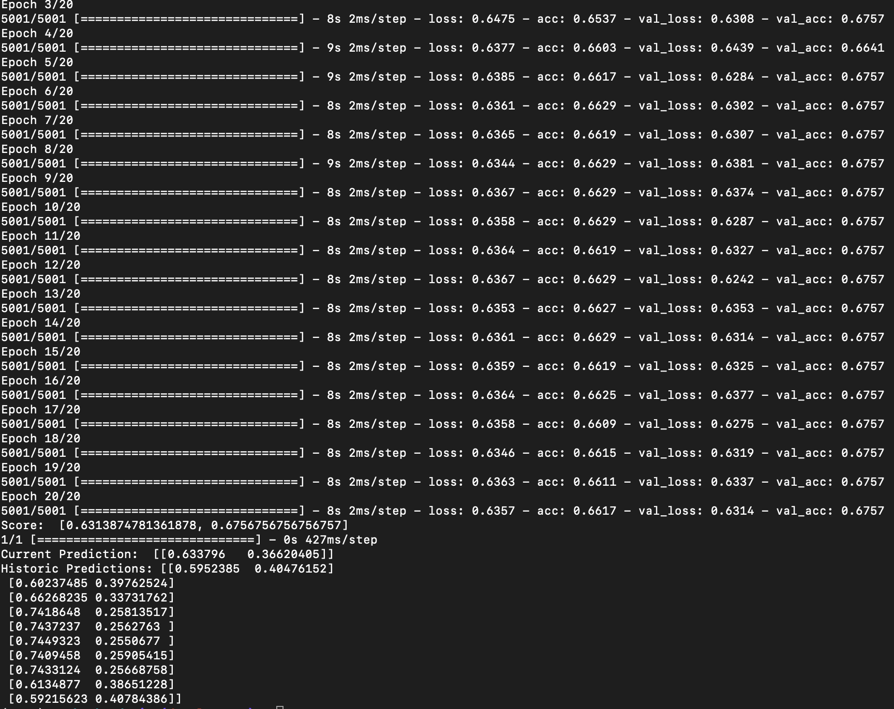

# Machine Learning Stock Picker

> The Machine Learning Stock Picker was an exercise on using Tensorflow and how to implement a machine learning model.  There are two versions of the ML model - continuous and discrete.  The discrete model classifies whether a stock will be 1% higher 5 trading days later, assigning a 0 (not 1% higher) or 1 (1% higher) to the prediction value.  The continuous model attempts to predict an exact price 5 tradings days later.

## Table of Contents

- [Installation](#installation)
- [Features](#features)
- [Challenges](#challenges)
- [Team](#team)

## Installation

Before beginning, an API key must be obtained from www.alphavantage.co. They key would be stored in the backend folder under a file KEY.py as API_SECRET_KEY

- Install any version of Python 3.6 (as long as it's not 3.7) from python.org
- In terminal, go to backend folder

```shell
python 3.6 -m venv venv
source venv/bin/activate
pip install -r requirements.txt
```

- From the above, you can run either the mlmodel-continuous or mlmodel-discrete file

### Clone

- Clone this repo to your local machine using `https://github.com/Lulzasaur/Machine-Learning-Stock-Picker.git`

---

## Features

- Users can use the ML model to test any stock ticker on the ML model. The ML parameters must be adjusted in the model files.

---

## Challenges (e.g. why aren't I rich yet?)

When working with any dataset for ML, a lot of issues can pop up that are not immediately apparent.  While the model can achieve over 80% accuracy, this can be very deceptive when figuring out what this means exactly. 

Balancing - it was difficult to balance the data between 0's and 1's for the classifier.  If there was an imbalance of one or the other, the model would quckly learn to choose the imbalanced feature from the dataset to achieve over 50% accuracy.

Data Integrety - related to balancing, because the stock market itself has been in a bull market for quite some time...we needed to gather more historical data so the ML model does not just predict a "buy".  There did not seem to be enough periods where stocks went down for a prolonged period of time to provide a truly random sampling of data to feed to the ML model.

---

## Team

| <a href="https://github.com/arecesj" target="_blank">**Juan Areces**</a>
| <a href="https://github.com/arecesj" target="_blank">`github.com/arecesj`</a> | 

| <a href="https://github.com/hasierpastor" target="_blank">**Hasier Pastor**</a>
| <a href="https://github.com/hasierpastor" target="_blank">`github.com/hasierpastor`</a> | 

